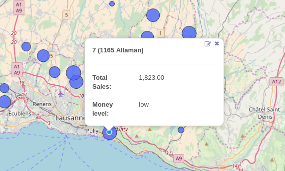

.. image:: https://img.shields.io/badge/licence-AGPL--3-blue.svg
    :alt: License

Geospatial support for Odoo
===========================

Geospatial support based on PostGIS add the ability of server to server
geojson to do geo CRUD and view definition.

Installation
============

To install this module, you need to have `PostGIS <http://postgis.net/>`_ installed.

On Ubuntu::

  sudo apt-get install postgis

The module also requires two additional python libs:

* `Shapely <http://pypi.python.org/pypi/Shapely>`_

* `geojson <http://pypi.python.org/pypi/geojson>`_

for a complete documentation please refer to the `public documenation <http://oca.github.io/geospatial/index.html>`_

Usage
=====

If you created a map view, you can create a custom view when clicking on a record.
This can be achieved by creating an HTML architecture insides a templates div.

For example, if you want to create a custom view for partners, you can proceed like
following.

.. code:: xml

    <geoengine>
        <field name="name"/>
        <field name="street"/>
        <field name="city"/>
        <field name="zip"/>
        <field name="country_id"/>

        <templates>
            <t t-name="layer-box">
                

                    <b>
                        <field name="name"/>
                    </b>
                    

                    

                        

                            <b>Country:</b>
                        

                        

                            <field name="country_id"/>
                        

                    

                     
                    

                        

                            <b>City:</b>
                        

                        

                          <field name="city"/>
                        

                    

                

            </t>
        </templates>
    </geoengine>

Here is an example of a custom geoengine record popup.

Known issues / Roadmap
======================

 * Google layers have been removed as it was not working anyway.
 * Switching from map to form view should be eased to open selected feature.
   It should work using `do_switch_view` and this probably requires to set `self.dataset.index`
 * A good way to open a record from map should be done with double click.
   However selection handlers have difficulties to work nice with click events.
 * Find a solution when two geometry objects overlap on the map

Bug Tracker
===========

Bugs are tracked on `GitHub Issues <https://github.com/OCA/geospatial/issues>`_.
In case of trouble, please check there if your issue has already been reported.
If you spotted it first, help us smashing it by providing a detailed and welcomed feedback.

Credits
=======

Contributors
------------

* Alexandre Fayolle <alexandre.fayolle@camptocamp.com>
* Frederic Junod <frederic.junod@camptocamp.com>
* Guewen Baconnier <guewen.baconnier@camptocamp.com>
* Laurent Mignon <laurent.mignon@acsone.eu>
* Nicolas Bessi <nicolas.bessi@camptocamp.com>
* Sandy Carter <sandy.carter@savoirfairelinux.com>
* Vincent Renaville <vincent.renaville@camptocamp.com>
* Yannick Vaucher <yannick.vaucher@camptocamp.com>
* Benjamin Willig <benjamin.willig@acsone.eu>

Maintainer
----------

.. image:: http://odoo-community.org/logo.png
   :alt: Odoo Community Association
   :target: http://odoo-community.org

This module is maintained by the OCA.

OCA, or the Odoo Community Association, is a nonprofit organization whose mission is to support the collaborative development of Odoo features and promote its widespread use.

To contribute to this module, please visit http://odoo-community.org.
