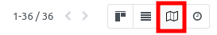

* go to 'Contact'.

* a new map icon is available.

* by clicking on it, the partners are displayed on the map, if the
  latitude and longitude are defined. (see ``base_geolocalize`` module)

.. figure:: ../static/description/view_res_partner_map.png
