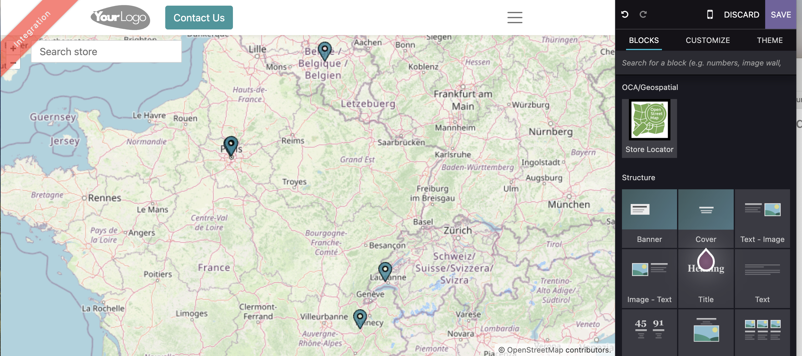
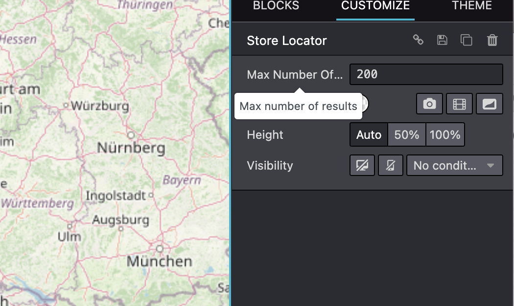
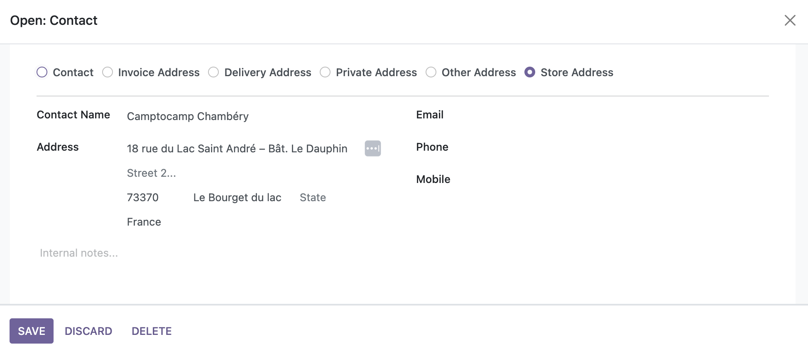
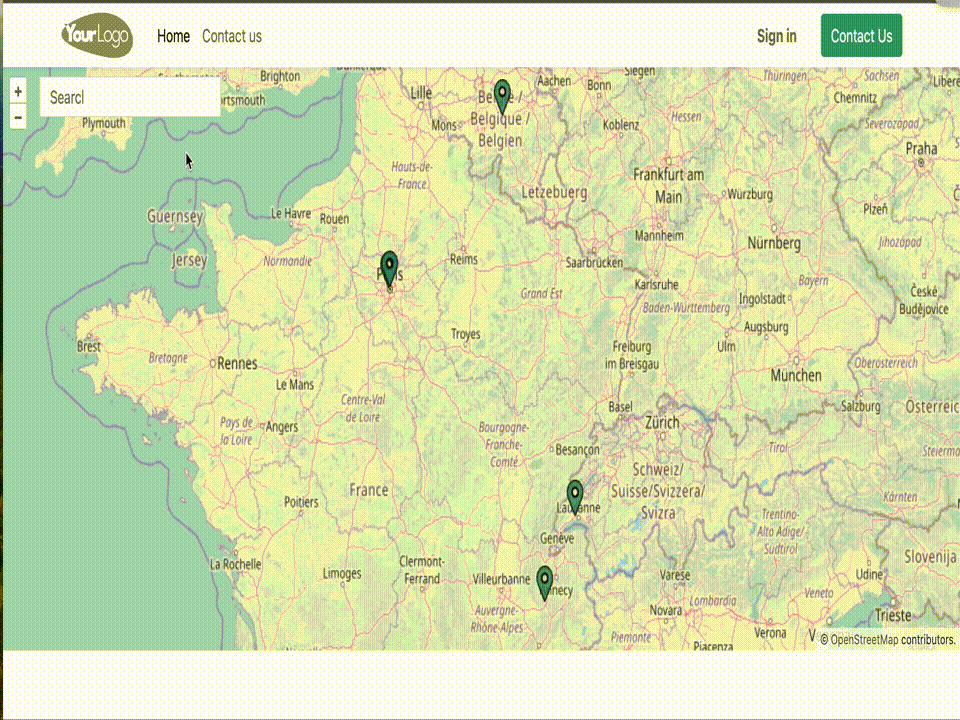

=============================================
Store map view widget (OpenStreetMap)
=============================================

This module extends the ``website_geoengine`` odoo module, to add
a map snippet view for the website.
By default the map features are filtered to only display contact of type `store`.

.. IMPORTANT::
   This is an alpha version, the data model and design can change at any time without warning.
   Only for development or testing purpose, do not use in production.
   `More details on development status <https://odoo-community.org/page/development-status>`_

**Table of contents**

.. contents::
   :local:

Configuration
=============

You should configure first a web site. Then drag n drop the Store Locator widget from the OCA/Geopspatial section.

You can the configure the maximum number of results you want to display before to force your user to filter results.

Then go to 'Contact' app and add some store type address to your contacts and add them some tags.

Usage
=====

Bug Tracker
===========

Bugs are tracked on `GitHub Issues <https://github.com/OCA/geospatial/issues>`_.
In case of trouble, please check there if your issue has already been reported.
If you spotted it first, help us to smash it by providing a detailed and welcomed
`feedback <https://github.com/OCA/geospatial/issues/new?body=module:%20web_view_leaflet_map_partner%0Aversion:%2016.0%0A%0A**Steps%20to%20reproduce**%0A-%20...%0A%0A**Current%20behavior**%0A%0A**Expected%20behavior**>`_.

Do not contact contributors directly about support or help with technical issues.

Credits
=======

Authors
~~~~~~~

* Stéphane Brunner <stephane.brunner@camptocamp.com>  
* Hadrien Huvelle <hadrien.huvelle@camptocamp.com>

Maintainers
~~~~~~~~~~~

This module is maintained by the OCA.

.. image:: https://odoo-community.org/logo.png
   :alt: Odoo Community Association
   :target: https://odoo-community.org

OCA, or the Odoo Community Association, is a nonprofit organization whose
mission is to support the collaborative development of Odoo features and
promote its widespread use.

This module is part of the `OCA/geospatial <https://github.com/OCA/geospatial/tree/16.0/website_geoengine_store_locator>`_ project on GitHub.

You are welcome to contribute. To learn how please visit https://odoo-community.org/page/Contribute.
